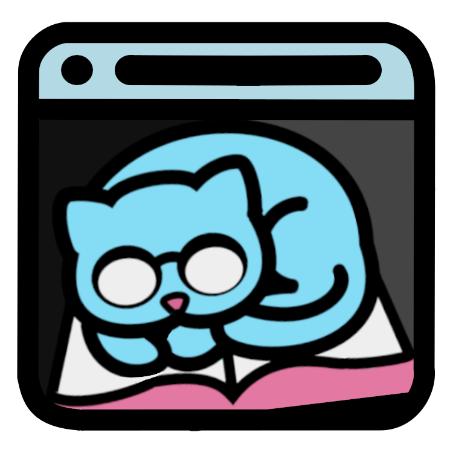

# scrollerCat - Browser Extension

Description: 

- This is a project, in-development, for my WEBD 495 Advanced Web Development course.
- The main feature of scrollerCat, the browser extension, is a single-line, left-to-right reading overlay, similar to subtitles.
You can stretch and shift this overlay to your liking while you read one long line of text, free of distraction.
- The extension uses optical character recognition (OCR) to supply the in-browser text to the scrolling overlay.

- For you, scrollerCat is a browser extension to help ease the pain of reading online.
  
- For me, scrollerCat is my chance to:
  -  Learn browser extension development
  -  Use the Tesseract.js library
  &
  - Interact with WebAssembly.
  

Installation:

  - For use of the single-line-scoller in isolation, please visit that <a href="https://github.com/JLobbes/phone-reader-project">repository</a>.
  - Installation instruction for the extention will be forthcoming as development progresses.

Start:

- 2024 May 30

Acknowledgements:

- This project uses [Tesseract.js](https://github.com/naptha/tesseract.js) under the Apache License 2.0.
